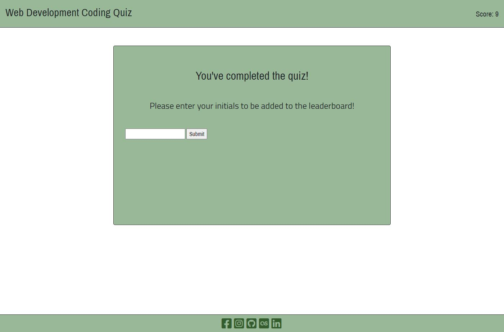

<a href="https://ethanrmcdowell.github.io/Code-Quiz/">Link to code quiz website</a>

The purpose of this project was to create a functional quiz using JavaScript. The website begins at a landing page which shows brief instructions and has a begin button. 

Upon hitting this button, you'll be brought to the first question and the timer will start counting down. When you hit an answer, you will receive an alert saying correct or incorrect, and when clicking off of that it will bring you to the next question. After answering the final question, you will be brought to a screen asking for your initials.

When you enter your initials and click submity, it will show you a leaderboard. 

The navbar in the head will show you the timer as well as dynamically update your current score after each question. You will receive five points for a correct answer, and each incorrect answer will deduct both three points and five seconds from the timer. If the timer expires, you will be brought to the screen asking for your initials.